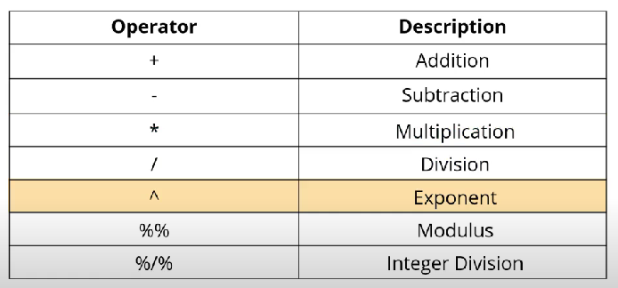
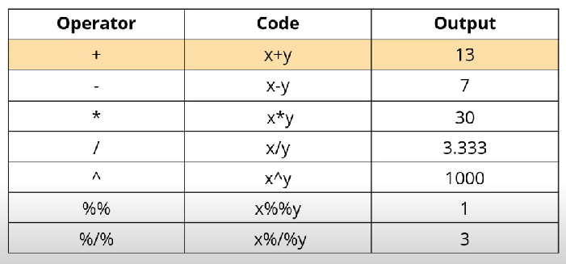
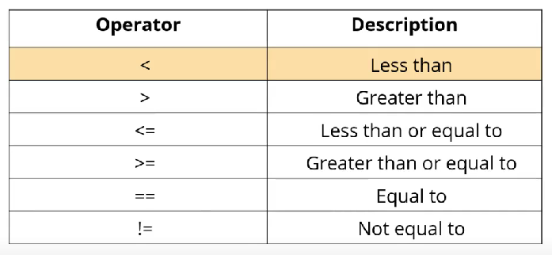
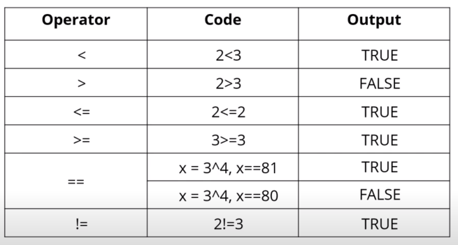
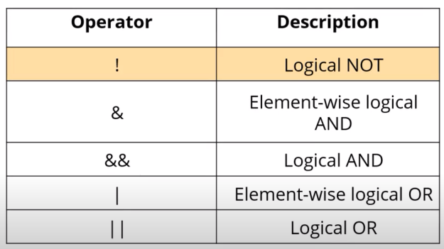
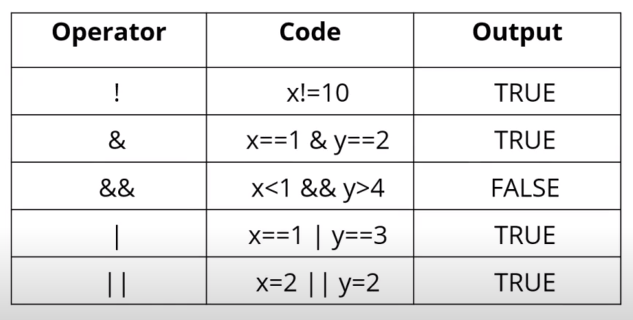
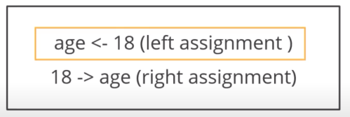
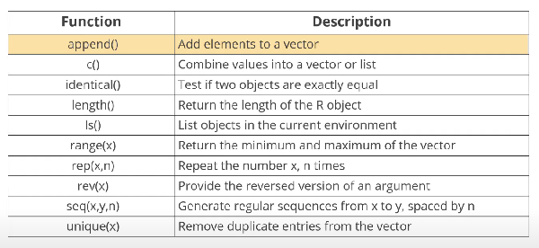
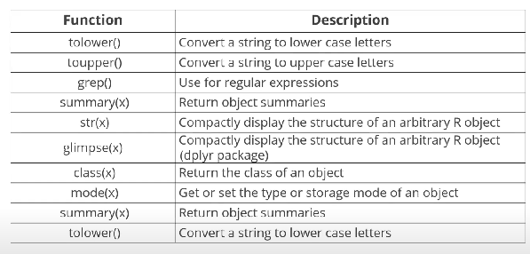

# Catatan dari R Studio

Add a new chunk by clicking the *Insert Chunk* button on the toolbar or by pressing *Ctrl+Alt+I*.

When you save the notebook, an HTML file containing the code and output will be saved alongside it (click the *Preview* button or press *Ctrl+Shift+K* to preview the HTML file).

The preview shows you a rendered HTML copy of the contents of the editor. Consequently, unlike *Knit*, *Preview* does not run any R code chunks. Instead, the output of the chunk when it was last run in the editor is displayed.

# Data Science with R Programming

Belajar R menggunakan [R Markdown Notebook](http://rmarkdown.rstudio.com). Belajar dari kelas gratisnya [Simplilearn](https://lms.simplilearn.com/courses/2716/Data-Science-with-R-Programming/syllabus) modulnya gratis selama kurang lebih 80 Hari.

Setiap baris code namanya *chunk* dan bisa di *Run* dengan menekan *Ctrl+Shift+Enter*.

# Data Types and Variables

Tipe data di bahasa R hampir sama dengan bahasa pada umumnya. Berikut adalah jenis variable yang ada di bahasa R:


```{r}
# Check type of variables
model1 <- 'hello'
typeof(model1)

# Class of model1
class(model1)

# Print model 1
model1

# Create new variables
modelku = 11
modelku + 11

# Typing using other variables
model_ku <- 'hello'
model_ku

modelKu <- 'hello'
modelKu

.model <- 100
.model

# Error variables
# 2model <- 'hello'
```

# Operators

Sama seperti bahasa pemrograman yang lainnya, Bahasa R juga memiliki sebuah operator, dalam bahasa R memiliki 4 kategori Operator yaitu Aritmatic Operators, Relational Operators, Logical Operators, dan Assignment Operator.


## Arithmetic Operators

Operator yang digunakan untuk melakukan perhitungan matematis.



sebagai contoh x=10; y=3. maka hasilnya adalah sebagai berikut ini:



## Relational Operators

Operator yang digunakan untuk membandingkan dua buah angka atau fungsi, dan memiliki hasil berupa vektor logika.



berbeda penggunaan antara = dan ==, simbol = digunakan untuk operator assign atau memasukkan nilai sedangkan simbol == digunakan untuk melihat kesamaan nilai antar dua variabel yang berbeda. Sebagai contoh adalah berikut:



## Logical Operators

Operator logika digunakan untuk melakukan sebuah operasi logika di dalam sebuah program, operatornya adalah AND dan OR



sebagai contoh x=1; y=2 maka hasilnya sebagai berikut:



## Operator Assignment

Operator ini digunakan untuk memasukkan nilai ke dalam sebuah variabel. bisa menggunakan simbol \<- atau =. contoh penggunaanya adalah sebagai berikut:



# Conditional Statements

Pernyataan kondisi dalam bahasa R bisa digunakan menggunakan perintah IF ELSE dan Switch.

## IF ELSE

menggunakan perintah bawaan dari bahasa R

```{r}
age <- 20
if (age > 18){
  print('Remaja')
}else{
  print('Tua')
}
```

menggunakan sintaks yang lebih singkat dengan function **ifelse()**

```{r}
age <- 20
ifelse(age>18, 'Remaja', 'Tua')
```

menggunakan Switch

```{r}
age <- 'Remaja'
switch(age, 
       Remaja={
         print('Usia antara 18 tahun')
       },
       Tua={
         print('Usia diatas 20 tahun')
       })
```

## IF ELSE Nested

```{r}
x <- 0
if (x<0){
  print('Angka negatif')
}else if (x>0){
  print('Angka positif')
}else{
  print('Angka nol')
}
```

# Iterations

## For Loops

Perulangan **for** digunakan untuk melakukan perulangan yang bisa dihitung jumlah perulangannya.

```{r}
vector <- c(1, 2, 3, 4, 5)
for (variable in vector) {
  print(variable)
}
```

## While Loops

Perulangan **while** digunakan untuk mengulang operasi yang tidak diketahui jumlahnya.

```{r}
i <- 1
while(i<6){
  print(i)
  i= i+1
}
```

## Repeat Loops

Perulangan yang akan mengulang berulangkali sampai dengan kondisi tertentu

```{r}
x <- 1
repeat{
  print(x)
  x =  x+1
  if (x == 6){
    break
  }
}
```

## Loop Control Statement

### Break

Digunakan untuk memberhentikan kode yang berjalan dengan kondisi tertentu sesuai yang diberikan

```{r}
num <- 1:5
for (val in num) {
  if (val == 3){
    break
  }
  print(val)
}
```

### Next

Digunakan untuk melakukan skip terhadap nilai tertentu tidak memberhentikan sebuah program yang berjalan

```{r}
num <- 1:5
for (val in num) {
  if (val == 3){
    next
  }
  print(val)
}
```

# Function





```{r}
age <- 18 
18 -> age 
print(age)
```
